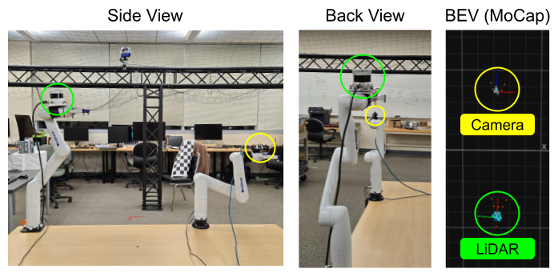
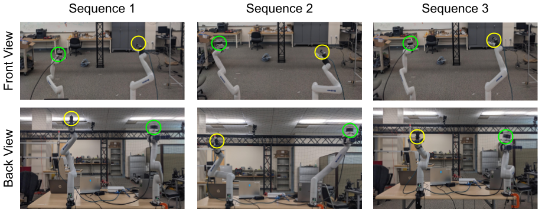
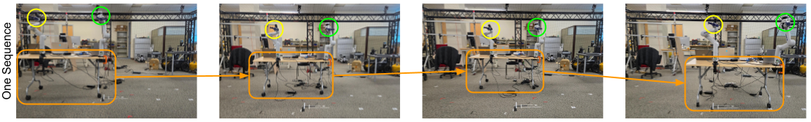
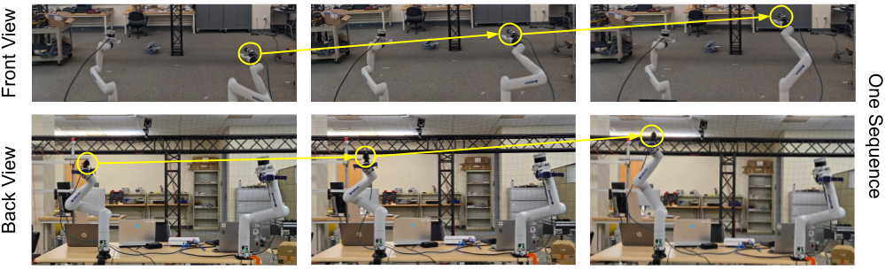
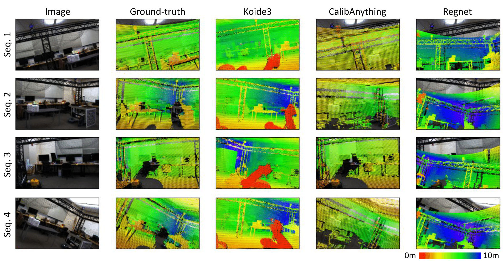

<link href='https://fonts.googleapis.com/css?family=Titillium+Web:400,600,400italic,600italic,300,300italic' rel='stylesheet' type='text/css'>
<head><meta http-equiv="Content-Type" content="text/html; charset=UTF-8">
  <title>CalibDB: Diverse Multimodal Calibration Benchmark</title>

<!-- <meta property="og:image" content="images/teaser_fb.jpg"> -->
<meta property="og:title" cfontent="TITLE">

<!-- Global site tag (gtag.js) - Google Analytics -->

<link media="all" href="./css/glab.css" type="text/css" rel="StyleSheet">

<link media="all" href="./css/slideshow.css" type="text/css" rel="StyleSheet">

<meta content="MSHTML 6.00.2800.1400" name="GENERATOR"></head>

<body data-gr-c-s-loaded="true">

<h1><strong>CalibDB: Diverse Multimodal Calibration Benchmark</strong></h1>

<h2> 
  <a href="https://jyue86.github.io/">Justin Yue</a>&nbsp;&nbsp;&nbsp;
  <a href="https://cisl.ucr.edu/CalibDB/">Ayoub Elidrissi</a>&nbsp;&nbsp;&nbsp;
  <a href="https://cisl.ucr.edu/CalibDB/">Divyank Shah</a>&nbsp;&nbsp;&nbsp;
  <a href="https://cisl.ucr.edu/CalibDB/">Jerin Peter</a>&nbsp;&nbsp;&nbsp;
  <a href="https://profiles.ucr.edu/app/home/profile/karydis">Konstantinos Karydis</a>&nbsp;&nbsp;&nbsp;
  <a href="https://hangqiu.github.io/">Hang Qiu</a>&nbsp;&nbsp;&nbsp;
</h2>

<h2>
        <a href="https://www.ucr.edu/">University of California, Riverside</a>&nbsp;&nbsp;&nbsp; 
</h2>

In submission, RSS 2025 Demo

<!-- 
<h2><a href="https://arxiv.org/abs/2112.14947">Paper</a> | <a href="https://cisl.ucr.edu/CalibDB/">Code</a> | <a href="https://youtu.be/uBmdCRmZNIo">Demo</a> | <a href="#bibtex">Bibtex</a> </h2>
 -->

<table border="0" cellspacing="10" cellpadding="0" align="center"> 
<tbody><tr><td><left>
CalibDB is a diverse and challenging multi-modal calibration dataset and benchmark. 
The dataset contains various discrete and continous traces from cameras and LiDARs, which are placed in different poses with dynamic extrinsics via robotic arms manipulation. 
The benchmark evaluates the state-of-the-art multi-modal calibration methods, which demonstrates the research gaps and the challenges existing methods face.
The proposed pipeline and dataset pave the way for the community to develop more accurate, robust, domain-transferable multimodal calibration methods.
</left></td></tr></tbody></table>

<table border="0" cellspacing="10" cellpadding="0" align="center">
  <tbody><tr><td align="center">

</td></tr>
</tbody>
</table>

<h1 align="center">CalibDB Overview</h1>
<table border="0" cellspacing="10" cellpadding="0" align="center"> 
<tbody>
<tr><td><left>
CalibDB's platform is useful for collecting a multi-modal calibration dataset. Placed in a motion capture (MoCap) environment, our platform mounts a LiDAR and camera sensors on 2 Kinova Gen3 Lite arms. We place MoCap markers on both the sensors and the robot arms' end effectors for precise tracking of their poses. The use of robot arms allows for automated and accurate placement of their respective sensors throughout the scene, allowing for diverse collection of the extrinsics between the sensors. These extrinsics are categorized as the following: discrete traces with static extrinsics, discrete traces with dynamic extrinsics, continuous traces with static extrinsics, and continuous traces with dynamic extrinsics.
</left>
</td></tr>
<tr><td>
<video muted autoplay loop width="1000" controls>
  <source src="./media/CalibDBOverview.mp4" type="video/mp4">
</video>
</td></tr>
</tbody>
</table>

<!-- <table border="0" cellspacing="10" cellpadding="0" align="center"> 
<tbody><tr><td><left>
TBD
</left>
</td></tr></tbody>
</table> -->

<h1 align="center">Data Collection</h1>
<table border="0" cellspacing="10" cellpadding="0" align="center">
<tbody>
<tr>
<td align="center">
<h2>Discrete Sequences w/ Static Extrinsics</h3>

</td>
</tr>
<tr>
<td align="center">
<h2>Continuous Sequences w/ Fixed Extrinsics</h3>

</td>
</tr>
<tr>
<td align="center">
<h2>Continuous Sequences w/ Dynamic Extrinsics</h3>

</td>
</tr>
</tbody>
</table>

<h1 align="center">Qualitative Results</h1>
<table border="0" cellspacing="10" cellpadding="0" align="center"> 
<tbody><tr><td><left>
The baseline methods' effectiveness can be confirmed by perform lidar-to-camera overlays using their predicted extrinsics. Surprisingly, these predicted extrinsics do not result in good overlays. Koide3 tends to change the orientation of the point cloud, suggesting poor transfer to the indoor setting. In some cases, CalibAnything's overlays appear as the closest to the ground-truth overlay, possibly due to using the ground-truth transform as the initial guess. Regnet's incorrect extrinsics is especially obvious from the large error in depth. Calibnet's results are omitted due to no points from the LiDAR point cloud projected into the image. 
<!-- We evaluate the CalibDB dataset with the current state-of-the-art methods: Koide3, CalibAnything, Regnet, and CalibNet. These methods perform poorly on the CalibDB dataset but perform well on out outdoor data that mirrors these baseline methods' original training and evaluation datasets. Thus, CalibDB demonstrates poor domain transfer with current methods. -->
</left></td></tr></tbody>
</table>
<table border="0" cellspacing="10" cellpadding="0" align="center">
<tbody>
<tr>
<td align="center">

</td>
</tr>
</tbody>
</table>

<h1 id="bibtex" align="center">Citation</h1>
<table border="0" cellspacing="10" cellpadding="0" align="center"> 
<tr><td><left>
<pre><code style="display:block; width:1000px; overflow-x: auto">TBD
</code></pre>
</left></td></tr></table>

<!--
 

<table align=center width=1000px>

<tr><td><left>

<h1>Acknowledgements</h1>

We would like to thank

</left></td></tr></table>

  
-->

<!-- GoStats JavaScript Based Code -->

<noscript></noscript>

<!-- End GoStats JavaScript Based Code -->
<!-- 

</body>
 -->

